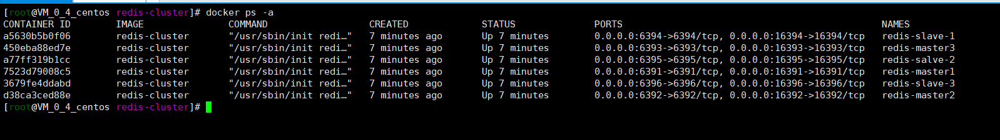

# redis-cluster
docker快速构建三主三从 redis-cluster

一、节点规划（三主三从）

| 容器名称  |  容器IP地址 | 映射端口号  |
| ------------ | ------------ | ------------ |
| redis-master1  | 172.20.0.2  | 6391->6391  |
| redis-master2  | 172.20.0.3  | 6392->6392  |
| redis-master3  | 172.20.0.4  | 6393->6393  |
| redis-slave-1  | 172.30.0.2  | 6394->6394  |
| redis-slave-2  | 172.30.0.3  | 6395->6395  |
| redis-slave-3  | 172.30.0.4  | 6396->6396  |

　　

二、下载文件
```
mkdir /data/docker
cd /data/docker
git clone https://github.com/haveyb/redis-cluster.git
cd redis-cluster
```　
　　
  
三、开始构建
　
1、构建镜像

```php
docker build -t redis-cluster /data/docker/redis-cluster
```

2、快速构建多个容器

```php
docker-compose up -d 
```


[注：安装docker-compose](https://www.haveyb.com/article/239 "安装docker-compose")


3、使用docker ps -a 查看结果



[教程地址：使用 docker-compose 构建 redis-cluster 集群 　](https://www.haveyb.com/article/237 "使用 docker-compose 构建 redis-cluster 集群 　")

